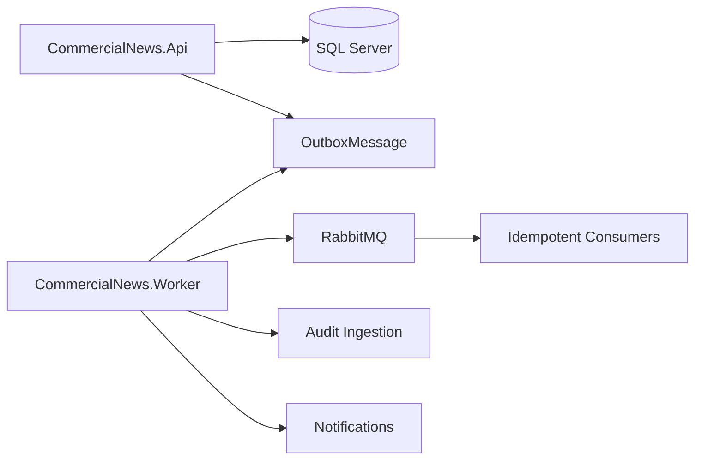

# CommercialNews


CommercialNews is a production-oriented modular news platform backend.

The project is built as a **V1 Modular Monolith** with clear module ownership,
SQL Server persistence, RabbitMQ event delivery, Worker-based asynchronous
processing, and reliable Outbox-driven integration.

It is designed to demonstrate backend architecture skills around:

* Clean Architecture and module boundaries.
* Module-owned database schemas.
* Reliable event delivery with Outbox + Worker + RabbitMQ.
* Public read projections for serving articles.
* Audit evidence and ingestion tracking.
* Notification delivery workflows.
* Docker-based local development and operational setup.

## 🧱 Current Backend Shape

CommercialNews currently runs with two main hosts:

| Host                    | Responsibility                                                                                                               |
| ----------------------- | ---------------------------------------------------------------------------------------------------------------------------- |
| `CommercialNews.Api`    | HTTP API host for public and admin endpoints                                                                                 |
| `CommercialNews.Worker` | Background host for outbox publishing, RabbitMQ consumers, projections, audit ingestion, notifications, and batch-style work |

Core infrastructure:

| Component      | Purpose                                                        |
| -------------- | -------------------------------------------------------------- |
| SQL Server     | One database with module-owned schemas                         |
| RabbitMQ       | At-least-once event transport                                  |
| Outbox         | Reliable event publication from truth transactions             |
| Docker Compose | Local runtime for API, Worker, SQL Server, RabbitMQ, and Nginx |

## 🧩 Modules

Current V1 modules:

| Module        | Responsibility                                                 |
| ------------- | -------------------------------------------------------------- |
| Content       | Article lifecycle, categories, tags, editorial source of truth |
| SEO           | Slug routes, canonical URLs, SEO metadata                      |
| Media         | Media assets and article-media attachments                     |
| Reading       | Public read projections and public serving state               |
| Interaction   | Views, likes, comments, moderation signals, public counters    |
| Identity      | Users, credentials, sessions, verification, password reset     |
| Authorization | Roles, permissions, user-role assignments                      |
| Audit         | Audit evidence, ingestion tracking, admin investigation        |
| Notifications | Email delivery and delivery state                              |
| Outbox        | Reliable integration event publication infrastructure          |

Each module owns its data and rules.

Cross-module integration should use stable IDs, application contracts, and events
instead of shared domain entities or direct table access.

## 🔄 Event Delivery Flow



Core integration rule:

```text
truth transaction -> OutboxMessage -> Worker -> RabbitMQ -> idempotent consumer
```

Business success should not depend on asynchronous side effects completing immediately.

## 📁 Repository Layout

```text
src/
  building-blocks/
  hosts/
    CommercialNews.Api/
    CommercialNews.Worker/
  modules/
db/
  00_bootstrap/
  10_modules/
docker/
docs/
```

Important entry points:

| Entry Point         | Path                                                           |
| ------------------- | -------------------------------------------------------------- |
| Solution            | `CommercialNews.sln`                                           |
| API project         | `src/hosts/CommercialNews.Api/CommercialNews.Api.csproj`       |
| Worker project      | `src/hosts/CommercialNews.Worker/CommercialNews.Worker.csproj` |
| Docker Compose      | `docker/docker-compose.dev.yaml`                               |
| Docker env template | `docker/.env.example`                                          |
| Documentation index | `docs/README.md`                                               |

## 🚀 Quick Start

Create or update local Docker environment values:

```bash
cp docker/.env.example docker/.env.dev
```

Edit `docker/.env.dev` with local development secrets and connection strings.

Do not commit real secrets.

Start the local runtime:

```bash
docker compose --env-file docker/.env.dev -f docker/docker-compose.dev.yaml up --build -d
```

Main local endpoints:

| Service             | URL                      |
| ------------------- | ------------------------ |
| API                 | `http://localhost:8080`  |
| Nginx proxy         | `http://localhost:8088`  |
| RabbitMQ management | `http://localhost:15672` |
| SQL Server          | `localhost,1433`         |

For full setup, database bootstrap order, and smoke checks, read:

* `docs/tutorials/01-onboarding.md`

## 🛠️ Build

Build API:

```bash
dotnet build src/hosts/CommercialNews.Api/CommercialNews.Api.csproj
```

Build Worker:

```bash
dotnet build src/hosts/CommercialNews.Worker/CommercialNews.Worker.csproj
```

Build the solution:

```bash
dotnet build CommercialNews.sln
```

## 🗄️ Database Scripts

Database scripts live under `db/`.

Bootstrap scripts:

* `db/00_bootstrap/`

Module scripts:

* `db/10_modules/{module}/001_tables.sql`
* `db/10_modules/{module}/010_indexes.sql`
* `db/10_modules/{module}/020_procs.sql`

Run bootstrap scripts first, then module scripts in dependency order.

See:

* `db/README.md`
* `docs/tutorials/01-onboarding.md`

## 📚 Documentation

Start with:

* `docs/README.md`
* `docs/tutorials/01-onboarding.md`
* `docs/explanation/architecture/arc42/00-index.md`
* `docs/reference/architect-operating-model.md`
* `docs/reference/architecture-quantum.md`

Documentation is organized as:

| Area                | Purpose                                         |
| ------------------- | ----------------------------------------------- |
| `docs/tutorials/`   | Guided learning paths                           |
| `docs/explanation/` | Architecture and domain reasoning               |
| `docs/reference/`   | Operating models, templates, and factual lookup |

## 🧠 Development Notes

* Domain owns invariants, value objects, exceptions, and pure policy vocabulary.
* Application owns use cases, validation, MediatR handlers, ports, and pipeline behaviors.
* Infrastructure owns SQL persistence, repositories, mappers, serializers, normalizers, redaction, and provider implementations.
* API owns HTTP routes, authorization policy attributes, contracts, and HTTP mapping.
* Worker owns outbox publishing, RabbitMQ consumers, envelope validation, and runtime message handling.
* DB scripts own module schema, indexes, and stored procedures.

## 🔐 Secrets

Do not commit real secrets.

Local secret-bearing files are intentionally ignored, including Docker env files
and local appsettings files. Use tracked templates such as `docker/.env.example`
for shape only.
